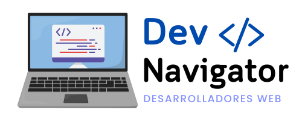

<!DOCTYPE html>
<html lang="es">
<head>
    <meta charset="UTF-8">
    <meta name="viewport" content="width=device-width, initial-scale=1.0">
   </head>
<body>

  

<h1>DevNavigator 💻🖱️💙</h1>

<h2>Descripción del Proyecto 🤓</h2>

  DevNavigator es una plataforma educativa diseñada para guiar a los estudiantes
  en su aprendizaje de tecnologías de desarrollo web. Ofrece una hoja de ruta
  clara y estructurada, módulos de aprendizaje, seguimiento de progreso y una
  comunidad de apoyo.

<h2>Integrantes del Equipo 👏</h2>
<table>
  <tr>
    <th>Integrante</th>
    <th>Rol</th>
  </tr>
  <tr>
    <td><strong>Garay, Damian</strong></td>
    <td>FrontEnd</td>
  </tr>
  <tr>
    <td><strong>Gonzalez, German</strong></td>
    <td>FrontEnd</td>
  </tr>
  <tr>
    <td><strong>Dantas, Thomas</strong></td>
    <td>FrontEnd</td>
  </tr>
  <tr>
    <td><strong>Rivera López, Jorge Eduardo</strong></td>
    <td>Backend</td>
  </tr>
  <tr>
    <td><strong>Di Donna Ramirez, John Alexander</strong></td>
    <td>BackEnd</td>
  </tr>
  <tr>
    <td><strong>Martinez, Mauricio</strong></td>
    <td>Backend</td>
  </tr>
</table>

<h2>Caso de Negocio 🤖</h2>

<h3>Contexto</h3>

  El proyecto se enfoca en el sector educativo, abordando las dificultades que
  enfrentan los estudiantes para estructurar su aprendizaje debido a la amplia
  variedad de recursos disponibles.

<h3>Objetivo</h3>

  La aplicación proporciona una hoja de ruta clara, módulos de aprendizaje y una
  comunidad de apoyo, permitiendo a los usuarios personalizar su experiencia de
  aprendizaje.

<h3>Valor Agregado</h3>

  Destaca por su enfoque personalizado y un sistema de suscripción para contenido
  exclusivo.

<h2>Funcionalidades 👾</h2>
<ul>
  <li>Autenticación propia y externa (JWT)</li>
  <li>Notificaciones vía email</li>
  <li>Almacenamiento de archivos en la nube</li>
  <li>Usuario administrador con dashboard</li>
  <li>Documentación de la API</li>
  <li>Implementación de plataforma de pagos</li>
  <li>ChatBot para preguntas frecuentes</li>
  <li>Sistema de notificación automática</li>
</ul>

<h2>Historias de Usuario</h2>
<ul>
  <li><strong>Usuario Invitado</strong>: Acceso a vista previa de módulos.</li>
  <li><strong>Usuario Registrado</strong>: Acceso a módulos basicos.</li>
  <li><strong>Usuario Subscrito</strong>: Acceso a módulos y contenido premium.</li>
  <li><strong>Usuario Administrador</strong>: Gestión de accesos y contenido.</li>
  <li><strong>Usuario Superadmin</strong>: Gestión completa de la plataforma.</li>
</ul>

<h2>Documentación del Proyecto</h2>

<h3>Diagrama de Arquitectura</h3>

  <a href="https://dbdiagram.io/d/6680ab209939893dae9e511f">https://dbdiagram.io/d/6680ab209939893dae9e511f</a>

<h3>DER - Diagrama Entidad Relacion</h3>

  <a href="https://dbdiagram.io/d/6680ab209939893dae9e511f">https://dbdiagram.io/d/6680ab209939893dae9e511f</a>

    
&copy; 2024 DevNavigator. Todos los derechos reservados.

</body>
</html>
